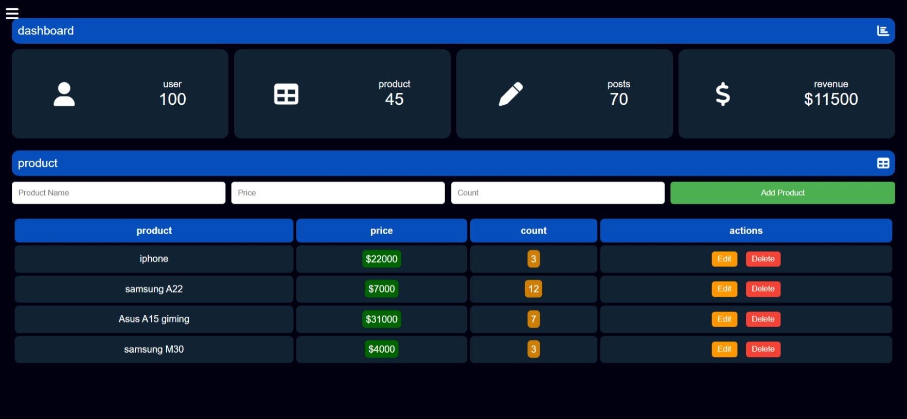

```markdown
# Beginner Dashboard UI

This project is a simple and beginner-friendly dashboard user interface (UI) built with HTML, CSS, and JavaScript. It serves as a basic training project for understanding front-end development concepts, including responsive design, DOM manipulation, and local storage usage.

## Features

- **Responsive Design**: The UI is designed to work on various screen sizes, from desktops to mobile devices (down to 340px).
- **Interactive Sidebar**: A collapsible sidebar that toggles visibility for better space management on smaller screens.
- **Product Management**:
  - Add new products with name, price, and count.
  - Edit existing product details.
  - Delete products from the list.
- **Local Storage**: All product data is saved in the browser's local storage, ensuring data persistence across page reloads.
- **Basic Styling**: Clean and minimalistic design using CSS for a professional look.

## Technologies Used

- **HTML**: Structure of the dashboard.
- **CSS**: Styling and responsive design.
- **JavaScript**: Dynamic functionality, including adding, editing, and deleting products.
- **Font Awesome**: Icons for a better user experience.

## How to Use

1. Clone the repository:
   ```bash
   git clone https://github.com/Ziad-Abaza/beginner-dashboard-ui.git
   ```
2. Open the `index.html` file in your browser.
3. Explore the dashboard:
   - Click on the "product" section to show/hide the product form.
   - Add, edit, or delete products using the provided buttons.
   - Observe how data persists even after refreshing the page.

## Project Structure

```
beginner-dashboard-ui/
│
├── index.html          # Main HTML file
├── style.css           # CSS for styling
├── img/                # Folder for images (e.g., profile picture)
└── README.md           # Project documentation
```

## Live Demo

Check out the live demo of the project:  
👉 [https://ziad-abaza.github.io/beginner-dashboard-ui/](https://ziad-abaza.github.io/beginner-dashboard-ui/)

## Screenshot



## Why This Project?

This project is ideal for beginners who want to practice:
- Building a responsive UI.
- Working with HTML forms and tables.
- Using JavaScript for DOM manipulation and local storage.
- Implementing basic CRUD (Create, Read, Update, Delete) operations.

## Future Improvements

- Add user authentication.
- Integrate a backend for data storage.
- Enhance the UI with animations and transitions.
- Add more dashboard features like charts and analytics.

